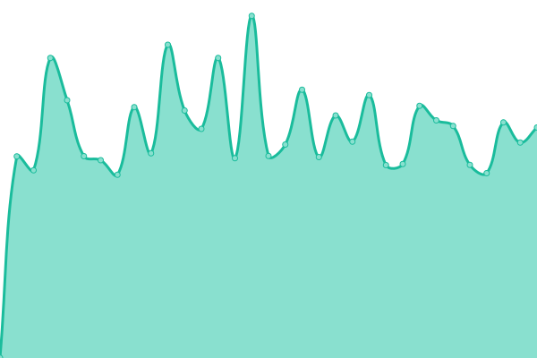

# [📈 Live Status](https://nbbrd.github.io/sdmx-upptime): <!--live status--> **🟧 Partial outage**

This repository contains the open-source uptime monitor and status page for [NBB Research and Development](https://nbbrd.github.io/sdmx-upptime), powered by [Upptime](https://github.com/upptime/upptime).

With [Upptime](https://upptime.js.org), you can get your own unlimited and free uptime monitor and status page, powered entirely by a GitHub repository. We use [Issues](https://github.com/nbbrd/sdmx-upptime/issues) as incident reports, [Actions](https://github.com/nbbrd/sdmx-upptime/actions) as uptime monitors, and [Pages](https://nbbrd.github.io/sdmx-upptime) for the status page.

<!--start: status pages-->
<!-- This summary is generated by Upptime (https://github.com/upptime/upptime) -->
<!-- Do not edit this manually, your changes will be overwritten -->
<!-- prettier-ignore -->
| URL | Status | History | Response Time | Uptime |
| --- | ------ | ------- | ------------- | ------ |
|  [ABS](https://api.data.abs.gov.au/dataflow/all/all/latest) | 🟩 Up | [abs.yml](https://github.com/nbbrd/sdmx-upptime/commits/HEAD/history/abs.yml) | 

 3308ms
     
 | 

<a href="https://nbbrd.github.io/sdmx-upptime/history/abs">100.00%</a>
    

|  [BBK](https://api.statistiken.bundesbank.de/rest/metadata/dataflow/BBK) | 🟩 Up | [bbk.yml](https://github.com/nbbrd/sdmx-upptime/commits/HEAD/history/bbk.yml) | 

 488ms
     
 | 

<a href="https://nbbrd.github.io/sdmx-upptime/history/bbk">100.00%</a>
    

|  [BIS](https://stats.bis.org/api/v1/dataflow/all/all/latest) | 🟩 Up | [bis.yml](https://github.com/nbbrd/sdmx-upptime/commits/HEAD/history/bis.yml) | 

 592ms
     
 | 

<a href="https://nbbrd.github.io/sdmx-upptime/history/bis">100.00%</a>
    

|  [CAMSTAT](https://nsiws-stable-camstat-live.officialstatistics.org/rest/dataflow/all/all/latest) | 🟩 Up | [camstat.yml](https://github.com/nbbrd/sdmx-upptime/commits/HEAD/history/camstat.yml) | 

 271ms
     
 | 

<a href="https://nbbrd.github.io/sdmx-upptime/history/camstat">100.00%</a>
    

|  [ECB](https://data-api.ecb.europa.eu/service/dataflow/all/all/latest) | 🟩 Up | [ecb.yml](https://github.com/nbbrd/sdmx-upptime/commits/HEAD/history/ecb.yml) | 

 829ms
     
 | 

<a href="https://nbbrd.github.io/sdmx-upptime/history/ecb">47.49%</a>
    

|  [EC_DG_COMP](https://webgate.ec.europa.eu/comp/redisstat/api/dissemination/sdmx/2.1/dataflow/all/all/latest) | 🟩 Up | [ec-dg-comp.yml](https://github.com/nbbrd/sdmx-upptime/commits/HEAD/history/ec-dg-comp.yml) | 

 848ms
     
 | 

<a href="https://nbbrd.github.io/sdmx-upptime/history/ec-dg-comp">99.79%</a>
    

|  [EC_DG_EMPL](https://webgate.ec.europa.eu/empl/redisstat/api/dissemination/sdmx/2.1/dataflow/all/all/latest) | 🟩 Up | [ec-dg-empl.yml](https://github.com/nbbrd/sdmx-upptime/commits/HEAD/history/ec-dg-empl.yml) | 

 651ms
     
 | 

<a href="https://nbbrd.github.io/sdmx-upptime/history/ec-dg-empl">99.79%</a>
    

|  [EC_DG_GROW](https://webgate.ec.europa.eu/grow/redisstat/api/dissemination/sdmx/2.1/dataflow/all/all/latest) | 🟩 Up | [ec-dg-grow.yml](https://github.com/nbbrd/sdmx-upptime/commits/HEAD/history/ec-dg-grow.yml) | 

 262ms
     
 | 

<a href="https://nbbrd.github.io/sdmx-upptime/history/ec-dg-grow">99.79%</a>
    

|  [ESCAP](https://api-dataexplorer.unescap.org/rest/dataflow/all/all/latest) | 🟩 Up | [escap.yml](https://github.com/nbbrd/sdmx-upptime/commits/HEAD/history/escap.yml) | 

 748ms
     
 | 

<a href="https://nbbrd.github.io/sdmx-upptime/history/escap">0.00%</a>
    

|  [ESTAT](https://ec.europa.eu/eurostat/api/dissemination/sdmx/2.1/dataflow/ESTAT/all/latest) | 🟩 Up | [estat.yml](https://github.com/nbbrd/sdmx-upptime/commits/HEAD/history/estat.yml) | 

 22628ms
     
 | 

<a href="https://nbbrd.github.io/sdmx-upptime/history/estat">83.64%</a>
    

|  [ESTAT_COMEXT](https://ec.europa.eu/eurostat/api/comext/dissemination/sdmx/2.1/dataflow/all/all/latest) | 🟩 Up | [estat-comext.yml](https://github.com/nbbrd/sdmx-upptime/commits/HEAD/history/estat-comext.yml) | 

 250ms
     
 | 

<a href="https://nbbrd.github.io/sdmx-upptime/history/estat-comext">99.81%</a>
    

|  [ILO](https://www.ilo.org/sdmx/rest/dataflow/all/all/latest) | 🟩 Up | [ilo.yml](https://github.com/nbbrd/sdmx-upptime/commits/HEAD/history/ilo.yml) | 

 5872ms
     
 | 

<a href="https://nbbrd.github.io/sdmx-upptime/history/ilo">100.00%</a>
    

|  [IMF](http://dataservices.imf.org/REST/SDMX_XML.svc/Dataflow) | 🟩 Up | [imf.yml](https://github.com/nbbrd/sdmx-upptime/commits/HEAD/history/imf.yml) | 

 790ms
     
 | 

<a href="https://nbbrd.github.io/sdmx-upptime/history/imf">82.46%</a>
    

|  [IMF_SDMX_CENTRAL](https://sdmxcentral.imf.org/ws/public/sdmxapi/rest/dataflow/all/all/latest) | 🟩 Up | [imf-sdmx-central.yml](https://github.com/nbbrd/sdmx-upptime/commits/HEAD/history/imf-sdmx-central.yml) | 

 1542ms
     
 | 

<a href="https://nbbrd.github.io/sdmx-upptime/history/imf-sdmx-central">87.65%</a>
    

|  [INEGI](https://sdmx.snieg.mx/service/Rest/dataflow/all/all/latest) | 🟥 Down | [inegi.yml](https://github.com/nbbrd/sdmx-upptime/commits/HEAD/history/inegi.yml) | 

 15641ms
     
 | 

<a href="https://nbbrd.github.io/sdmx-upptime/history/inegi">0.00%</a>
    

|  [INSEE](https://bdm.insee.fr/series/sdmx/dataflow/all/all/latest/) | 🟩 Up | [insee.yml](https://github.com/nbbrd/sdmx-upptime/commits/HEAD/history/insee.yml) | 

 1287ms
     
 | 

<a href="https://nbbrd.github.io/sdmx-upptime/history/insee">100.00%</a>
    

|  [ISTAT](https://esploradati.istat.it/SDMXWS/rest/dataflow/all/all/latest) | 🟩 Up | [istat.yml](https://github.com/nbbrd/sdmx-upptime/commits/HEAD/history/istat.yml) | 

 27647ms
     
 | 

<a href="https://nbbrd.github.io/sdmx-upptime/history/istat">55.92%</a>
    

|  [NB](https://data.norges-bank.no/api/dataflow/all/all/latest) | 🟩 Up | [nb.yml](https://github.com/nbbrd/sdmx-upptime/commits/HEAD/history/nb.yml) | 

 2078ms
     
 | 

<a href="https://nbbrd.github.io/sdmx-upptime/history/nb">64.14%</a>
    

|  [NBB](https://stat.nbb.be/restsdmx/sdmx.ashx/GetDataStructure/ALL) | 🟩 Up | [nbb.yml](https://github.com/nbbrd/sdmx-upptime/commits/HEAD/history/nbb.yml) | 

 1338ms
     
 | 

<a href="https://nbbrd.github.io/sdmx-upptime/history/nbb">76.61%</a>
    

|  [OECD](https://stats.oecd.org/restsdmx/sdmx.ashx/GetDataStructure/ALL) | 🟩 Up | [oecd.yml](https://github.com/nbbrd/sdmx-upptime/commits/HEAD/history/oecd.yml) | 

 2504ms
     
 | 

<a href="https://nbbrd.github.io/sdmx-upptime/history/oecd">98.71%</a>
    

|  [SE](http://andmebaas.stat.ee/restsdmx/sdmx.ashx/GetDataStructure/ALL) | 🟩 Up | [se.yml](https://github.com/nbbrd/sdmx-upptime/commits/HEAD/history/se.yml) | 

 1782ms
     
 | 

<a href="https://nbbrd.github.io/sdmx-upptime/history/se">100.00%</a>
    

|  [SGR](https://registry.sdmx.org/ws/rest/dataflow/all/all/latest) | 🟩 Up | [sgr.yml](https://github.com/nbbrd/sdmx-upptime/commits/HEAD/history/sgr.yml) | 

 738ms
     
 | 

<a href="https://nbbrd.github.io/sdmx-upptime/history/sgr">100.00%</a>
    

|  [SIMEL](https://disseminatesimel.mtps.gob.sv/rest/dataflow/all/all/latest) | 🟩 Up | [simel.yml](https://github.com/nbbrd/sdmx-upptime/commits/HEAD/history/simel.yml) | 

 3261ms
     
 | 

<a href="https://nbbrd.github.io/sdmx-upptime/history/simel">86.75%</a>
    

|  [SPC](https://stats-nsi-stable.pacificdata.org/rest/dataflow/all/all/latest) | 🟩 Up | [spc.yml](https://github.com/nbbrd/sdmx-upptime/commits/HEAD/history/spc.yml) | 

 1507ms
     
 | 

<a href="https://nbbrd.github.io/sdmx-upptime/history/spc">100.00%</a>
    

|  [STATCAN](https://www150.statcan.gc.ca/t1/wds/rest/getAllCubesListLite) | 🟩 Up | [statcan.yml](https://github.com/nbbrd/sdmx-upptime/commits/HEAD/history/statcan.yml) | 

 2800ms
     
 | 

<a href="https://nbbrd.github.io/sdmx-upptime/history/statcan">100.00%</a>
    

|  [STATEC](https://lustat.statec.lu/rest/dataflow/all/all/latest) | 🟩 Up | [statec.yml](https://github.com/nbbrd/sdmx-upptime/commits/HEAD/history/statec.yml) | 

 2372ms
     
 | 

<a href="https://nbbrd.github.io/sdmx-upptime/history/statec">85.06%</a>
    

|  [TNSO](https://ns1-oshub.nso.go.th/rest/dataflow/all/all/latest) | 🟥 Down | [tnso.yml](https://github.com/nbbrd/sdmx-upptime/commits/HEAD/history/tnso.yml) | 

 0ms
     
 | 

<a href="https://nbbrd.github.io/sdmx-upptime/history/tnso">0.00%</a>
    

|  [UIS](http://data.uis.unesco.org/RestSDMX/sdmx.ashx/GetDataStructure/ALL) | 🟩 Up | [uis.yml](https://github.com/nbbrd/sdmx-upptime/commits/HEAD/history/uis.yml) | 

 1593ms
     
 | 

<a href="https://nbbrd.github.io/sdmx-upptime/history/uis">99.35%</a>
    

|  [UKDS](https://stats2.digitalresources.jisc.ac.uk/restsdmx/sdmx.ashx/GetDataStructure/ALL) | 🟩 Up | [ukds.yml](https://github.com/nbbrd/sdmx-upptime/commits/HEAD/history/ukds.yml) | 

 1191ms
     
 | 

<a href="https://nbbrd.github.io/sdmx-upptime/history/ukds">100.00%</a>
    

|  [UNDATA](https://data.un.org/WS/rest/dataflow/all/all/latest) | 🟩 Up | [undata.yml](https://github.com/nbbrd/sdmx-upptime/commits/HEAD/history/undata.yml) | 

 4428ms
     
 | 

<a href="https://nbbrd.github.io/sdmx-upptime/history/undata">100.00%</a>
    

|  [UNICEF](https://sdmx.data.unicef.org/ws/public/sdmxapi/rest/dataflow/all/all/latest) | 🟩 Up | [unicef.yml](https://github.com/nbbrd/sdmx-upptime/commits/HEAD/history/unicef.yml) | 

 610ms
     
 | 

<a href="https://nbbrd.github.io/sdmx-upptime/history/unicef">100.00%</a>
    

|  [WB](https://api.worldbank.org/v2/sdmx/rest/dataflow/all/all/latest/) | 🟩 Up | [wb.yml](https://github.com/nbbrd/sdmx-upptime/commits/HEAD/history/wb.yml) | 

 91ms
     
 | 

<a href="https://nbbrd.github.io/sdmx-upptime/history/wb">100.00%</a>
    

|  [WITS](http://wits.worldbank.org/API/V1/SDMX/V21/rest/dataflow/all/all/latest) | 🟩 Up | [wits.yml](https://github.com/nbbrd/sdmx-upptime/commits/HEAD/history/wits.yml) | 

 66ms
     
 | 

<a href="https://nbbrd.github.io/sdmx-upptime/history/wits">100.00%</a>
    

<!--end: status pages-->

[**Visit our status website →**](https://nbbrd.github.io/sdmx-upptime)

## 📄 License

- Powered by: [Upptime](https://github.com/upptime/upptime)
- Code: [MIT](./LICENSE) © [NBB Research and Development](https://nbbrd.github.io/sdmx-upptime)
- Data in the `./history` directory: [Open Database License](https://opendatacommons.org/licenses/odbl/1-0/)
